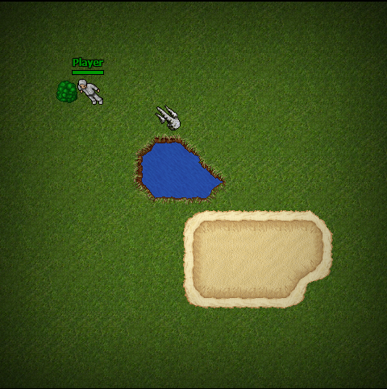

# Tibia JS Experiment

A funny experiment recreating Tibia with JavaScript and React.

## Demo

Use WASD keys to move character.

https://tibia-js.netlify.com

## Roadmap

- [x] Walkable player (with CSS animation!)
- [x] CSS field animation
- [x] Name and life bars
- [x] Map system with z-index
- [x] Tibia things as components (with styled-components too!)
- [ ] More ground and water tiles
- [ ] Walls and collision
- [ ] Field damage when walk into it
- [ ] More field types
- [ ] First monster with basic AI
- [ ] Monster attacking player
- [ ] Attack with right click
- [ ] Store items in backpack
- [ ] Use items
- [ ] Looting system
- [ ] Basic map editor